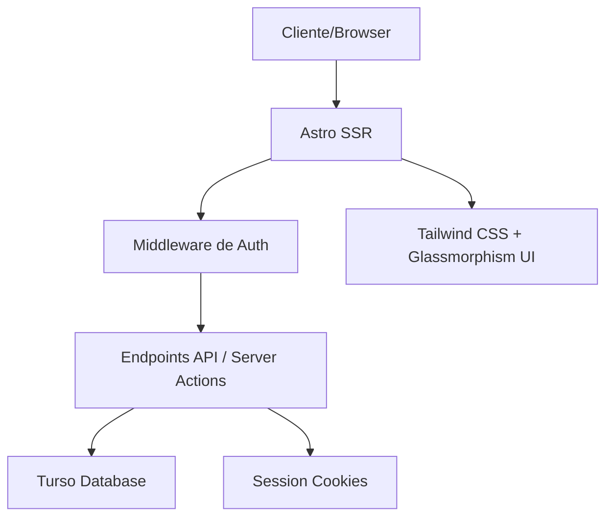

# Medinote — Documentación Técnica

> Referencia técnica completa para mantenimiento y desarrollo futuro.

---

## Arquitectura del Sistema



**Resumen:** Medinote es una aplicación full-stack server-rendered construida con Astro. Utiliza el modo SSR con adaptador de Vercel. La autenticación se maneja mediante middleware que verifica cookies de sesión antes de renderizar cada página. El sistema implementa RBAC (Role-Based Access Control) donde cada ruta y componente verifica permisos según el rol del usuario.

---

## Stack Técnico Detallado

| Capa | Tecnología | Versión | Propósito | Documentación |
|------|-----------|---------|-----------|---------------|
| Framework | Astro | 5.0.0 | SSR, rutas API, componentes islands | https://docs.astro.build |
| Lenguaje | TypeScript | 5.9.3 | Tipado estático | https://www.typescriptlang.org |
| Estilos | Tailwind CSS | 3.4.0 | Utility-first CSS | https://tailwindcss.com |
| Database | Turso (libSQL) | — | SQLite distribuido en la nube | https://docs.turso.tech |
| ORM | Drizzle ORM | 0.45.1 | Query builder y migraciones | https://orm.drizzle.team |
| Auth | Cookie-based Sessions | — | Estado de sesión en cookies | — |
| Seguridad | bcryptjs | 3.0.3 | Hash de contraseñas | — |
| Hosting | Vercel | — | Serverless deployment | https://vercel.com/docs |

---

## Estructura del Proyecto

```
src/
├── components/              # Componentes reutilizables
│   ├── Dashboard/           # 6 dashboards especializados por rol
│   │   ├── AdminDashboard.astro
│   │   ├── DoctorDashboard.astro
│   │   ├── NutritionistDashboard.astro
│   │   ├── CoachDashboard.astro
│   │   ├── StudentDashboard.astro
│   │   └── StaffDashboard.astro
│   ├── Patient/             # Formularios y UI de pacientes
│   ├── Appointment/         # Formularios de citas
│   ├── Medication/          # Componentes de inventario
│   ├── Nutrition/           # Formularios nutricionales
│   └── ui/                  # Componentes base (Sidebar, etc.)
├── functions/               # Utilidades
│   ├── checkRole.ts         # Sistema RBAC con ROLES constant
│   └── getSession.ts        # Decodificación de session cookie
├── layouts/                 # Layouts de página
│   ├── Layout.astro         # Layout principal (autenticado)
│   └── AuthLayout.astro     # Layout para login/register
├── pages/                   # Rutas (file-based routing)
│   ├── api/                 # Endpoints API
│   │   ├── auth/logout.ts
│   │   ├── accept-plan.ts
│   │   └── toggle-user-status.ts
│   ├── patients/            # CRUD pacientes
│   ├── appointments/        # Agenda médica
│   ├── consultations/       # Consultas médicas
│   ├── injuries/            # Lesiones deportivas
│   ├── medications/         # Inventario
│   ├── nutrition/           # Módulo nutrición
│   ├── users/               # Gestión de usuarios
│   ├── notes/               # Notas colaborativas
│   ├── reports/             # Reportes
│   ├── login.astro
│   ├── register.astro
│   ├── mi-perfil.astro
│   └── index.astro          # Dashboard router
├── middleware.ts            # Auth middleware (ejecuta en cada request)
├── turso.ts                 # Cliente de base de datos
└── env.d.ts                 # Tipos de entorno
```

### Archivos Clave

| Archivo | Responsabilidad |
|---------|----------------|
| `src/middleware.ts` | Verifica cookie de sesión en cada request, inyecta usuario en `Astro.locals` |
| `src/turso.ts` | Configura cliente de Turso con variables de entorno |
| `src/functions/checkRole.ts` | Define ROLES constant y función checkRole() para RBAC |
| `src/functions/getSession.ts` | Decodifica cookie de sesión base64 a objeto usuario |
| `src/pages/index.astro` | Router de dashboards basado en roleId |
| `src/components/ui/sidebar/SideBar.astro` | Navegación dinámica basada en permisos |

---

## Base de Datos

### Tablas / Colecciones

La base de datos utiliza SQLite/Turso. Las tablas principales son:

#### `Users`

| Campo | Tipo | Descripción | Notas |
|-------|------|-------------|-------|
| `userId` | INTEGER | ID único | PK, AUTOINCREMENT |
| `firstName` | TEXT | Nombre | NOT NULL |
| `lastName` | TEXT | Apellido | NOT NULL |
| `email` | TEXT | Correo único | UNIQUE, NOT NULL |
| `password` | TEXT | Hash bcrypt o texto plano | NOT NULL |
| `roleId` | INTEGER | Rol del usuario | FK → Roles |
| `isActive` | BOOLEAN | Estado de cuenta | DEFAULT 1 |

#### `Patients`

| Campo | Tipo | Descripción | Notas |
|-------|------|-------------|-------|
| `patientId` | INTEGER | ID único | PK, AUTOINCREMENT |
| `userId` | INTEGER | Usuario asociado | FK → Users |
| `birthDate` | DATE | Fecha de nacimiento | — |
| `gender` | TEXT | Género | — |
| `phone` | TEXT | Teléfono | — |
| `address` | TEXT | Dirección | — |
| `emergencyContact` | TEXT | Contacto emergencia | — |

#### `Appointments`

| Campo | Tipo | Descripción | Notas |
|-------|------|-------------|-------|
| `appointmentId` | INTEGER | ID único | PK |
| `patientId` | INTEGER | Paciente | FK |
| `doctorId` | INTEGER | Doctor asignado | FK → Users |
| `dateTime` | DATETIME | Fecha y hora | — |
| `reason` | TEXT | Motivo de consulta | — |
| `status` | TEXT | Estado | Scheduled, Completed, Cancelled |

#### `Consultations`

| Campo | Tipo | Descripción | Notas |
|-------|------|-------------|-------|
| `consultationId` | INTEGER | ID único | PK |
| `patientId` | INTEGER | Paciente | FK |
| `doctorId` | INTEGER | Doctor | FK |
| `appointmentId` | INTEGER | Cita asociada | FK, nullable |
| `diagnosis` | TEXT | Diagnóstico | — |
| `treatment` | TEXT | Tratamiento | — |
| `notes` | TEXT | Notas adicionales | — |
| `createdAt` | TIMESTAMP | Fecha de creación | DEFAULT CURRENT_TIMESTAMP |

#### `Injuries`

| Campo | Tipo | Descripción | Notas |
|-------|------|-------------|-------|
| `injuryId` | INTEGER | ID único | PK |
| `patientId` | INTEGER | Paciente | FK |
| `injuryType` | TEXT | Tipo de lesión | — |
| `description` | TEXT | Descripción | — |
| `injuryDate` | DATE | Fecha de lesión | — |
| `status` | TEXT | Estado | Activa, En recuperación, Curada |

#### `Medications`

| Campo | Tipo | Descripción | Notas |
|-------|------|-------------|-------|
| `medicationId` | INTEGER | ID único | PK |
| `name` | TEXT | Nombre del medicamento | NOT NULL |
| `description` | TEXT | Descripción | — |
| `currentStock` | INTEGER | Stock actual | DEFAULT 0 |
| `reorderPoint` | INTEGER | Punto de reorden | Alerta si stock <= este valor |

#### `NutritionProfiles`

| Campo | Tipo | Descripción | Notas |
|-------|------|-------------|-------|
| `profileId` | INTEGER | ID único | PK |
| `patientId` | INTEGER | Paciente | FK |
| `weight` | REAL | Peso en kg | — |
| `height` | REAL | Altura en cm | — |
| `bmi` | REAL | Índice de masa corporal | Calculado |
| `goals` | TEXT | Objetivos nutricionales | — |

#### `NutritionPlans`

| Campo | Tipo | Descripción | Notas |
|-------|------|-------------|-------|
| `planId` | INTEGER | ID único | PK |
| `profileId` | INTEGER | Perfil nutricional | FK |
| `nutritionistId` | INTEGER | Nutriólogo creador | FK → Users |
| `planName` | TEXT | Nombre del plan | — |
| `meals` | TEXT | Comidas (JSON/texto) | — |
| `isAccepted` | BOOLEAN | Aceptado por paciente | DEFAULT 0 |

#### `CollaborativeNotes`

| Campo | Tipo | Descripción | Notas |
|-------|------|-------------|-------|
| `noteId` | INTEGER | ID único | PK |
| `patientId` | INTEGER | Paciente | FK |
| `authorId` | INTEGER | Autor | FK → Users |
| `content` | TEXT | Contenido de la nota | NOT NULL |
| `isAlert` | BOOLEAN | Es alerta importante | DEFAULT 0 |
| `createdAt` | TIMESTAMP | Fecha de creación | DEFAULT CURRENT_TIMESTAMP |

### Índices Importantes

| Tabla | Índice | Campos | Propósito |
|-------|--------|--------|-----------|
| Users | idx_email | email | Búsqueda rápida login |
| Users | idx_role | roleId | Filtrado por rol |
| Appointments | idx_datetime | dateTime | Ordenamiento cronológico |
| Appointments | idx_patient | patientId | Citas por paciente |
| Patients | idx_user | userId | Join con Users |

---

## APIs y Endpoints

### Endpoints Internos

#### `POST /api/auth/logout`

- **Propósito:** Cierra sesión eliminando la cookie
- **Autenticación:** Required
- **Response:** Redirección a /login

#### `POST /api/accept-plan`

- **Propósito:** Paciente acepta plan nutricional
- **Autenticación:** Required
- **Body:** `{ planId: number }`
- **Response:** `{ success: boolean }`

#### `POST /api/toggle-user-status`

- **Propósito:** Admin activa/desactiva cuenta de usuario
- **Autenticación:** Required (Admin/Jefe Médico)
- **Body:** `{ userId: number }`
- **Response:** `{ success: boolean, isActive: boolean }`

### Patrón Server Actions

La mayoría de las operaciones CRUD utilizan formularios HTML con método POST directo a las páginas Astro. El patrón es:

```astro
---
if (Astro.request.method === 'POST') {
  const data = await Astro.request.formData();
  // Procesar y guardar en DB
}
---
<form method="POST">...</form>
```

### Servicios Externos Conectados

| Servicio | Para Qué | Credenciales | Documentación |
|----------|----------|-------------|---------------|
| Turso | Base de datos | `TURSO_DATABASE_URL`, `TURSO_AUTH_TOKEN` | https://docs.turso.tech |
| Vercel | Hosting | — | https://vercel.com/docs |

**Nota sobre credenciales:**
- 🔑 **Del servicio:** Turso DB credentials
- ⚠️ **Nunca compartir:** TURSO_AUTH_TOKEN

---

## Autenticación y Seguridad

- **Método:** Sessions basadas en cookies
- **Sesiones:** Cookie "session" con payload JWT-like codificado en base64
- **Roles:** 7 roles definidos en ROLES constant (1=Admin, 2=Jefe Médico, 3=Doctor, 4=Nutriólogo, 5=Estudiante, 6=Staff, 7=Entrenador)
- **Protecciones:**
  - Middleware verifica sesión en cada request
  - Función checkRole() filtra acceso por rol
  - Sidebar filtra links según permisos
  - Contraseñas hasheadas con bcrypt

---

## Cómo Hacer Cambios Comunes

### Agregar una nueva página

1. Crear archivo `.astro` en `src/pages/`
2. Agregar verificación de sesión en el frontmatter
3. Agregar link en `SideBar.astro` con los roles permitidos
4. Usar `Layout.astro` como wrapper

### Modificar un modelo / tabla

1. Ejecutar migración con `npm run db:generate`
2. Aplicar con `npm run db:push`
3. Actualizar tipos si es necesario

### Agregar un nuevo endpoint de API

1. Crear archivo en `src/pages/api/`
2. Exportar función para método HTTP (POST, GET, etc.)
3. Verificar sesión con `getSession()`
4. Retornar Response con JSON

### Cambiar estilos / branding

- Colores definidos en Tailwind config
- Estilos globales en `src/styles/globals.css`
- Paleta actual: Teal/Sky para branding médico
- Glassmorphism: clases `glass-strong`, `glass-card`

### Agregar una nueva variable de entorno

1. Agregar a `.env` local
2. Agregar a Vercel Environment Variables
3. Acceder via `import.meta.env.VAR_NAME`

---

## Deploy y CI/CD

- **Plataforma:** Vercel
- **Branch de producción:** main
- **Auto-deploy:** Sí, en cada push a main
- **Build command:** `astro check && astro build`
- **Dominio:** https://app-medico-v2.vercel.app

### Proceso de Deploy

1. Push a branch main
2. Vercel detecta cambios
3. Ejecuta `npm ci` y `npm run build`
4. Deploy automático

### Rollback

En Vercel dashboard:
1. Ir a Deployments
2. Seleccionar commit anterior
3. Click "Promote to Production"

---

## Servicios de Terceros

| Servicio | Plan Actual | Costo | Renovación | Dashboard |
|----------|------------|-------|------------|-----------|
| Turso | Free tier (Starter) | $0 | Mensual (límites de uso) | https://app.turso.tech |
| Vercel | Hobby (Free) | $0 | — | https://vercel.com/dashboard |

---

## Monitoreo y Logs

- **Logs de aplicación:** Vercel Dashboard → Logs
- **Database logs:** Turso Dashboard → Query Analytics
- **Errores:** Vercel capture automáticamente errores 500

---

## Backups

- **Base de datos:** Turso incl backups automáticos en planes pagos. En free tier, exportar manualmente:
  ```bash
  turso db shell appmedica .dump > backup.sql
  ```
- **Archivos/Assets:** No hay almacenamiento de archivos (solo datos estructurados)

---

## Contacto del Desarrollador

| | |
|---|---|
| **Nombre** | José Pablo Mateos Gamboa |
| **Email** | josepablomateosgamboa@gmail.com |
| **Empresa** | Estudiante UMAD |
| **Fecha de entrega** | 4 de abril, 2026 |

---

*Documentación generada automáticamente y revisada por el desarrollador.*
